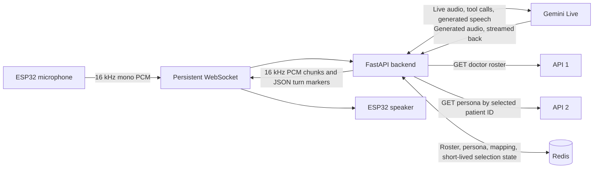

# Architecture and Data Flow

This document describes the current implementation in `main/main.c` and `backend/server.py`. Those files are the source of truth if an older diagram, generated code dump, or diagnostic note says something different.

## 1. What the system does

The ESP32-S3 captures the doctor's speech and streams audio to a Python backend over a persistent WebSocket. The backend connects to Gemini Live, sends the microphone audio, handles Gemini's patient lookup tool calls, and streams Gemini's generated speech back to the ESP32. For a patient lookup, the backend finds the patient in API 1's roster, fetches that patient's persona from API 2, checks the identity, and returns the cleaned record to Gemini for a spoken answer.

The live voice flow uses API 1 and API 2. `backend/patient_persona.json` is not the live lookup source.

## 2. Components and responsibilities

| Component | Runs on | Responsibility |
|---|---|---|
| Microphone and speaker board | Waveshare ESP32-S3-AUDIO | Captures audio through the board codec and plays returned audio. |
| ESP-IDF firmware | ESP32-S3 | Voice activity detection, mono PCM framing, persistent WebSocket, playback buffering, buttons, status LEDs, reconnect handling. |
| FastAPI relay | PC or server | Owns the device WebSocket, connects to Gemini Live, calls API 1/API 2, manages lookup state and Redis cache, and streams audio to/from the device. |
| Gemini Live | Google service | Interprets streamed speech, decides when to call backend tools, generates conversational text/audio, and returns turn-completion events. |
| API 1 | `200.97.162.162:8000` | Returns the patient roster for the configured doctor. |
| API 2 | `200.97.162.162:8000` | Returns the persona for the selected patient ID. |
| Redis | Local Redis or remote Redis-compatible service | Caches roster/personas and stores short-lived patient-selection state and verified ID mappings. |



## 3. Addresses and identity values

The API server and the voice relay are separate services. The API host is not the ESP32 WebSocket host.

| Link | Current configuration | Meaning |
|---|---|---|
| API 1 roster | `http://200.97.162.162:8000/agent/patients/{doctor_id}` | Backend-to-patient-service HTTP request. |
| API 2 persona | `http://200.97.162.162:8000/persona-hardware/{patient_id}` | Backend-to-persona-service HTTP request authenticated with the configured hardware token. The patient ID comes from the selected API 1 row or a verified mapping. |
| Device WebSocket | `ws://<backend-host>:8008/ws/live/<doctor-id>` | ESP32-to-backend connection. Configure the host and doctor ID for your deployment. |

The doctor ID in the WebSocket path identifies the doctor/session. The configured `PATIENTS_API_DOCTOR_ID` identifies which roster API 1 should return. They are currently configured to the same ID, but are separate settings so they can be changed independently. Patient IDs are selected per request and must never be replaced with a sample patient ID.

The current local WebSocket address requires the PC running FastAPI and the ESP32 to be reachable on the same LAN. If the PC's LAN address changes, update **Relay Server Host / IP / Domain** in ESP-IDF `menuconfig`, rebuild, and flash. The backend listens on `0.0.0.0:8008` so LAN devices can connect; Windows Firewall must allow the port.

## 4. Complete conversation flow

### 4.1 Backend startup

1. `python server.py` starts Uvicorn/FastAPI on the configured `PORT` (default `8008`).
2. The lifespan startup checks whether `GEMINI_API_KEY` is configured and attempts to ping Redis.
3. The backend makes a forced API 1 roster refresh for `PATIENTS_API_DOCTOR_ID` and warms the in-process roster cache. A complete non-empty roster is written to Redis.
4. A valid API 1 response with `total` must contain that same number of roster rows. Invalid or truncated responses are not cached as a complete roster.
5. If API 1 returns an empty roster or becomes unavailable, an unexpired cached roster can be retained. An expired roster is not kept alive by repeatedly extending its expiry.

### 4.2 Device connects and Gemini session opens

1. At boot, the ESP32 joins Wi-Fi and opens the persistent WebSocket using the configured relay host, port, and doctor ID. It does not wait for a spoken wake phrase to create the WebSocket.
2. The backend accepts `/ws/live/{doctor_id}`, associates an ephemeral connection ID with the connection, and opens a Gemini Live session using `GEMINI_LIVE_MODEL` (default `gemini-3.1-flash-live-preview`).
3. Gemini Live is configured for audio input and output, the `Kore` voice by default, automatic speech activity detection, and backend tools. The backend handles Gemini session resumption/reconnect behavior where supported.

### 4.3 Speech capture and wake/greeting behavior

1. Firmware continuously reads the codec input. It converts the captured two-channel 32-bit input to 16-bit mono by selecting the louder of the two captured channels for each sample.
2. Firmware calculates RMS loudness over short audio chunks. It starts streaming after voice activity crosses the configured threshold; it retains a small pre-roll so the first speech sound is less likely to be clipped.
3. **The current firmware uses loudness-based voice activity detection; it does not run a local speech-recognition wake-word model.** “Hello Assistant” is heard and interpreted by Gemini as a greeting after audio is sent.
4. While the doctor speaks, 16 kHz, 16-bit mono PCM frames stream to the backend. After about one second of silence, firmware sends the JSON marker `{"event":"audio_end"}`. The backend also has a silence safety timeout if this marker is missing.
5. The backend boosts incoming audio by the configured input gain and forwards PCM to Gemini Live. The firmware and backend avoid sending microphone audio while assistant playback is active, reducing speaker echo from being sent back as speech.

### 4.4 Greeting and patient-name resolution

1. Gemini transcribes/interprets the utterance. On a greeting such as “Hello Assistant,” the system prompt tells it to greet the doctor and ask which patient to discuss.
2. When Gemini recognizes a patient name or exact patient ID, it calls the backend's `load_patient_record` tool (also exposed under the alias `get_patient_persona`).
3. The backend searches the API 1 roster using normalized name tokens or an exact patient ID. It prefers an exact full-name match. It does not fuzzy-match similarly spelled names and does not use a phone number as a general search key.
4. If no roster match exists, the tool returns `not_found`; if the roster is empty it returns `empty_roster`; if the API/cache cannot supply a roster it returns an error status. The instructions tell Gemini not to invent or substitute another patient.

### 4.5 Duplicate names and last-four verification

1. If a spoken full name exactly identifies more than one roster row, the backend stores only those candidate row IDs and the normalized name in connection-scoped state. The state expires after `REDIS_PENDING_TTL_S` (default 180 seconds).
2. Gemini asks the doctor for the last four digits of the phone number. It does not receive candidate phone numbers.
3. The backend accepts exactly four digits and checks them against phone values in API 1 only for the pending candidate rows and the same exact normalized name.
4. Only one unique matching row is accepted. Zero matches asks for the digits again; multiple matches remain ambiguous. The digits cannot be used as a general patient search.
5. When the spoken name is incomplete and matches differently named patients, the backend asks for the full name first; it does not immediately request phone digits.

### 4.6 API 2 persona lookup and validation

1. The selected API 1 row's ID is used as the patient identifier unless API 1 supplied an explicit persona ID or Redis holds a mapping that was previously verified.
2. The backend requests `GET /persona-hardware/{patient_id}` with the configured `x-hardware-token` header when `PERSONA_HARDWARE_TOKEN` is set.
3. A non-empty persona payload is checked against the selected API 1 row. A matching patient ID can verify identity when API 2 omits part of the name. If both services provide a name component and it conflicts, or the IDs conflict, the backend rejects the persona rather than risk using another patient's record. If API 2 supplies no matching ID, the fallback is an exact normalized full-name match.
4. Only after validation does the backend cache the persona, store the active patient for that WebSocket session, clean the record, and return it to Gemini as tool data.
5. Cleaning removes identifiers/metadata, URLs, and JWT-like values before the clinical data is handed to Gemini. Gemini is instructed to answer from the loaded persona only and to avoid making up missing facts or prescribing medication changes.
6. API 2 `404`, invalid payload, and identity mismatch are different outcomes. A roster match with no API 2 persona is not reported as a missing roster patient.

### 4.7 Spoken response and audio playback

1. Gemini returns generated speech audio in chunks. The backend resamples Gemini's 24 kHz audio to 16 kHz PCM, applies output gain, and paces transmission so it does not get too far ahead of the device playback rate.
2. The backend sends binary PCM WebSocket frames and finally a JSON `turn_complete` event.
3. The ESP32 puts audio into a 64 KiB playback ring buffer. It waits for a 200 ms pre-buffer, drains audio to the speaker, and re-buffers across short gaps such as tool calls. A six-second stall guard prevents indefinite playback waiting.
4. At turn completion the device finishes the queued audio, briefly holds the microphone to avoid acoustic echo, and listens again. The WebSocket stays connected unless the network/server disconnects; both sides contain reconnect handling.

### 4.8 Gemini service-status announcements

Status announcements are generated by the backend's Edge TTS path and sent as ordinary PCM audio plus a `turn_complete` event. They bypass Gemini, so they can still be spoken when Gemini is rejecting requests, as long as the backend, WebSocket, and Edge TTS service are available.

- If a Gemini error indicates quota/spend-cap exhaustion (for example, `RESOURCE_EXHAUSTED` or a quota/billing message), the backend speaks: **“We are updating the system.”** It announces once while quota remains unavailable and pauses Gemini retry attempts for 60 seconds between retries to avoid a tight reconnect loop. A completed Gemini turn clears the quota-notice latch.
- If Gemini was active and then its session drops or requests a restart, the backend speaks: **“Restarting system.”** It announces once during that outage, then permits a new restart notice after Gemini completes a response successfully.
- Initial connection failures that happen before Gemini has ever become active do not use the restart announcement. If status TTS cannot produce audio or the device WebSocket has disconnected, the backend logs the failure; it cannot guarantee an audible message without a working speaker path.

## 5. Redis and in-memory cache behavior

Redis is a shared cache/state layer, not the source of truth; API 1 and API 2 remain the source of patient data.

| Data | Redis key purpose | Default lifetime | Notes |
|---|---|---:|---|
| API 1 roster | Doctor-scoped `roster` key | 24 hours | Full roster list. In-process cache is refreshed on a shorter interval (10 minutes). Empty/incomplete responses do not replace a valid full roster. |
| API 2 persona | Doctor/patient-scoped `persona-v2` key | 5 minutes | Only a validated persona is cached. Older unverified cache keys are not reused. |
| Row-to-persona mapping | Doctor and API 1 row ID scoped mapping | 24 hours | Written from explicit API 1 mapping or after successful API 2 identity validation. |
| Pending duplicate choice | Doctor and WebSocket connection scoped | 3 minutes | Candidate IDs and normalized name only; phone digits are checked against the roster at confirmation time. |
| Active patient/session state | Doctor and WebSocket connection scoped | 30 minutes | Used by conversation tools to keep current selection. |

If Redis is unreachable, the backend warns and uses process-local caches/state where implemented. In-memory values are lost when the backend restarts and are not shared between multiple backend processes. If running more than one backend instance, use a reachable shared Redis service and keep the service configuration consistent.

An optional seed utility, `backend/seed_patient_roster_redis.py`, can load a saved complete API 1 response into Redis when an administrator has confirmed that the API returned an empty list. The response must be complete and its `total` must match the row count. Avoid storing roster exports in source control or sharing them: they contain personal data.

## 6. Network topology and endpoints

### Local development topology

```text
ESP32 -- WebSocket ws://<backend-host>:8008/ws/live/{doctor_id} --> PC running FastAPI
PC running FastAPI -- HTTP --> API 1 and API 2 at 200.97.162.162:8000
PC running FastAPI -- Redis protocol/TLS --> local Redis or configured Redis service
PC running FastAPI -- Gemini Live connection --> Google Gemini
```

The firmware's WebSocket routes accepted by the backend are:

- `/ws/live/{session_id}` — used by the current ESP32 firmware.
- `/ws/live` — uses `DEFAULT_DOCTOR_ID`.
- `/ws/voice_dynamic/{session_id}` — compatibility route.

The backend health endpoint is `GET /`. It reports that the relay process is online; it does not prove that API 1, API 2, Gemini, or Redis are all healthy.

There is also a secondary `POST /api/chat-audio` REST/TTS path. It is separate from the persistent ESP32 Gemini Live WebSocket flow.

## 7. Configuration reference

Copy `backend/.env.example` to `backend/.env` and edit the local copy. Do not place real keys or bearer tokens in README, source code, screenshots, logs, or ZIPs.

| Variable | Purpose | Default/example in template |
|---|---|---|
| `GEMINI_API_KEY` | Authenticates the backend to Gemini. Required for live conversation. | Placeholder; replace locally. |
| `GEMINI_LIVE_MODEL` | Gemini Live model. | `gemini-3.1-flash-live-preview` |
| `GEMINI_API_VERSION` | Gemini API version used for Live. | `v1alpha` in code. |
| `GEMINI_VOICE` | Generated speech voice. | `Kore` |
| `PORT` | FastAPI/Uvicorn port. | `8008` |
| `PATIENTS_API_BASE_URL` | API 1 roster base URL. | `http://200.97.162.162:8000/agent/patients` |
| `PATIENTS_API_DOCTOR_ID` | Doctor ID appended to API 1 URL. | Set in the local environment. |
| `DEFAULT_DOCTOR_ID` | Doctor ID for `/ws/live` without a path ID. | Set in the local environment. |
| `PERSONA_API_BASE_URL` | API 2 persona base URL. | `http://200.97.162.162:8000/persona-hardware` |
| `PERSONA_HARDWARE_TOKEN` | API 2 token sent as `x-hardware-token`. | Placeholder; set a current token locally. |
| `API1_REQUEST_TIMEOUT_S` | API 1 request timeout. | `35` seconds. |
| `API2_REQUEST_TIMEOUT_S` | API 2 request timeout. | `8` seconds. |
| `PATIENT_LOOKUP_TIMEOUT_S` | Overall backend tool timeout. | `45` seconds. |
| `REDIS_URL` | Redis URL; use `rediss://` or `REDIS_TLS=true` for TLS. | Local Redis URL. |
| `REDIS_TLS` | Convert `redis://` endpoint to TLS where appropriate. | `false` |
| `REDIS_KEY_PREFIX` | Namespace prefix for this app's Redis keys. | `yhealth-assistant` |
| `REDIS_ROSTER_TTL_S` | Roster cache TTL. | `86400` seconds. |
| `REDIS_SESSION_TTL_S` | Active conversation state TTL. | `1800` seconds. |
| `REDIS_PENDING_TTL_S` | Duplicate confirmation TTL. | `180` seconds. |
| `REDIS_PERSONA_MAP_TTL_S` | Verified persona mapping TTL. | `86400` seconds. |
| `PERSONA_ID_FALLBACK_TO_ROSTER_ID` | Allows trying the API 1 row ID when no explicit persona ID is known; returned identity is still validated. | `true` |
| `LIVE_ADVANCED` | Enables Gemini session resumption/compression/transcription options. | Enabled unless set to `0`. |
| `GEMINI_IN_GAIN` / `GEMINI_OUT_GAIN` | Input/output audio gain. | Code defaults `1.4` / `0.46`. |

The firmware's relay host, doctor ID, port, and Wi-Fi settings are ESP-IDF Kconfig values in the **Gemini Assistant Configuration** menu. A TLS toggle is declared in Kconfig, but the current `main.c` URL builder still constructs `ws://` URLs; do not assume that enabling this option makes the current firmware use `wss://`. Local `sdkconfig` files can contain network credentials and are excluded from this repository; configure them locally before building.

## 8. Run the backend on Windows PowerShell

Use a normal PowerShell window for the Python backend:

```powershell
cd C:\Users\tanvi-admin\Downloads\Desk_Assistant\gemini_voice_assistant_fixed\backend
python -m venv .venv
.\.venv\Scripts\Activate.ps1
python -m pip install --upgrade pip
pip install -r requirements.txt
if (-not (Test-Path .env)) { Copy-Item .env.example .env }
notepad .env
python server.py
```

Put valid local values for `GEMINI_API_KEY` and `PERSONA_HARDWARE_TOKEN`. Configure Redis if using remote Redis (for example, a TLS Redis provider) or start local Redis if using the template default. Keep the backend terminal open. Open `http://127.0.0.1:8008/` on the PC to check that the process responds.

The ESP32 connects over LAN to the PC's current IPv4 address. Confirm the address with `ipconfig`; if it is not `192.168.50.53`, change the relay-host Kconfig value, rebuild, and flash. Allow inbound TCP port `8008` through Windows Firewall for the local network.

## 9. Build and flash the ESP32-S3

Use an ESP-IDF 5.5 environment (ESP-IDF PowerShell/terminal) with the board connected over USB. `idf.py` must be available in that terminal. From the project root:

```powershell
cd C:\Users\tanvi-admin\Downloads\Desk_Assistant\gemini_voice_assistant_fixed
idf.py set-target esp32s3
idf.py menuconfig
```

In `menuconfig`, open **Gemini Assistant Configuration** and confirm the Wi-Fi SSID/password and backend relay host/port. For the current local backend, use the PC's LAN IP and port `8008`; leave secure WSS disabled for local `ws://` development. Save and exit. On subsequent builds, `set-target` is usually unnecessary.

Flash and monitor (replace `COM6` if Windows assigned a different port):

```powershell
idf.py -p COM6 flash monitor
```

To build without flashing use `idf.py build`; to open just the serial monitor use `idf.py -p COM6 monitor`. If `idf.py` is not recognized, open the ESP-IDF terminal or export the IDF environment first. If port binding fails, close the other serial monitor/application using that COM port.

## 10. Observability and useful logs

The backend logs:

- Incoming HTTP requests: method, URL (query values omitted), status code, and duration.
- Incoming WebSocket route when a device attempts to connect.
- Outgoing API HTTP requests: method, URL, response status, and duration.
- Roster counts/cache activity, patient tool status, Gemini connection/reconnect and turn completion.
- Doctor/assistant transcriptions when Gemini returns transcription text.

Authorization headers and HTTP response bodies are not included by the added URL access logger. However, application logs can still contain patient names, spoken transcription, and patient IDs in API paths. Treat logs as sensitive clinical data: restrict access and retention, and do not paste unredacted logs into public issue trackers.

Typical backend sequence:

```text
✅ Redis cache connected
HTTP OUT -> GET http://200.97.162.162:8000/agent/patients/{doctor_id}
HTTP OUT <- GET ... status=200 duration_ms=...
Roster cache pre-warmed: N patients in RAM
WS IN -> ws://.../ws/live/{doctor_id}
ESP32 connected ...
Opening Gemini Live session ...
Gemini Live session ACTIVE
Tool 'load_patient_record' ...
HTTP OUT -> GET http://200.97.162.162:8000/persona-hardware/{patient_id}
API 2 persona loaded and identity-verified ...
Turn Complete ...
```

The roster/persona cache may serve a request without an outgoing API URL log entry. That means the value came from cache, not that a request was missed.

## 11. Troubleshooting

| Symptom | What it usually means | Checks |
|---|---|---|
| ESP32 cannot connect to WebSocket | Wrong PC LAN IP/port, firewall, backend stopped, or device and PC are on different networks. | Confirm `python server.py` is running, check the relay host in `menuconfig`, check Windows Firewall TCP 8008, and look for `WS IN` in backend logs. |
| `idf.py` is not recognized | The shell is not an ESP-IDF environment. | Open ESP-IDF PowerShell or load the ESP-IDF export script, then retry. |
| Port 8008 is already in use | Another Uvicorn/Python/backend process is already listening there. | Identify the listener with `Get-NetTCPConnection -LocalPort 8008 -State Listen`; stop only the intended old server. |
| API 1 returns `total=0` | The remote API returned an empty roster for that doctor. | Confirm the doctor ID with the API owner; the app can use a valid unexpired Redis roster if one exists, but an empty API result is not a name-matching failure. |
| Patient name is not found | Spoken name may differ from the roster or roster data is unavailable. | Check API 1 roster availability and spelling. Matching is exact/token-based; similar-sounding names are not substituted. |
| Assistant asks for last four digits | The same full name identifies multiple roster rows. | Provide exactly the last four phone digits for one of those pending rows. This prompt expires after three minutes. |
| API 2 returns 404 | The selected ID is not an API 2 persona ID/assignment on that service. | Check API 1's persona mapping or the API 2 assignment. Do not substitute a sample patient ID. |
| API 2 returns 200 but persona is rejected | The response ID or any available name component conflicts with the API 1 row. | Review the redacted API schema/identity fields and mapping. The validator blocks uncertain cross-patient data. |
| Gemini key error | Key is missing, invalid, revoked, or not enabled for the model/API. | Set a current key in the private `backend/.env`; restart the backend. Never paste the key into a log or README. |
| Redis unavailable | Cache service is unreachable or TLS/credentials are wrong. | Check endpoint, TLS mode, firewall, and provider credentials. Backend can fall back to process-local state, which is lost on restart and is not shared across instances. |
| Playback is clipped or logs ring-buffer drops | Wi-Fi jitter or playback cannot drain audio as quickly as it arrives. | Check signal/network, device buffer warnings, and backend pacing. The firmware uses pre-buffering and a bounded playback buffer; persistent drops may require tuning based on fresh logs. |

## 12. Current implementation boundaries

- Clinical patient records are sourced from API 2, not a hard-coded sample persona.
- The backend currently stores `add_clinical_note` and `escalate_alert` results in process-local Python dictionaries. Those tools are prototypes: they do not persist notes to a clinical system or deliver a real patient alert, and their data disappears when the backend restarts.
- Redis caches and conversation selection state are not a substitute for API authorization or clinical record storage.
- The README and this architecture document explain behavior; they do not certify the system for clinical deployment. Review privacy, authorization, audit, retention, and clinical workflows before production use.

## 13. Source layout

```text
gemini_voice_assistant_fixed/
├── backend/
│   ├── server.py                    # FastAPI, Gemini relay, API1/API2, Redis, tools
│   ├── requirements.txt             # Python dependencies
│   ├── .env.example                 # Safe configuration template; fill private .env locally
│   ├── seed_patient_roster_redis.py # Optional roster-cache import utility
│   ├── Dockerfile                   # Container build
│   └── docker-compose.yml           # Local/container launch configuration
├── main/
│   ├── main.c                       # ESP32 app, VAD, WebSocket, audio queue/playback
│   ├── hardeware_driver/            # Board codec and hardware initialization
│   ├── wifi_driver/                 # Wi-Fi connection/retry logic
│   ├── rgb_led_driver/              # LEDs and volume display
│   ├── Kconfig.projbuild            # Firmware Wi-Fi/relay settings
│   └── idf_component.yml            # ESP-IDF component dependencies
├── CMakeLists.txt                   # ESP-IDF project entry point
├── sdkconfig                        # Local ESP-IDF build config; review before sharing
├── README.md                        # Project entry point and quick commands
└── ARCHITECTURE_AND_DATA_FLOW.md    # This detailed design and process description
```

`build/`, `.pio/`, `.venv/`, and generated files are local build artifacts, not source requirements. `backend/.env` and roster/persona exports must remain private and outside source control.
